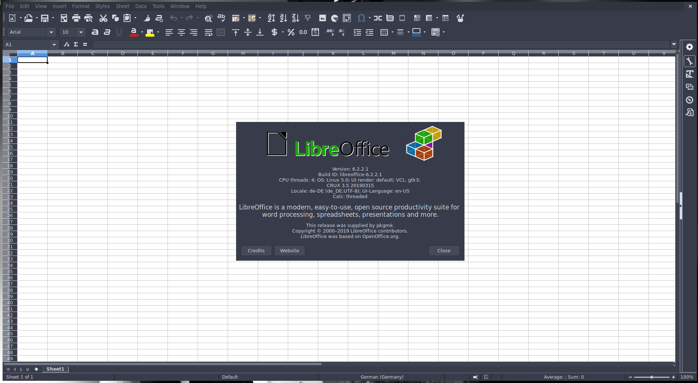

# crux-libreoffice

Early stage, expect footprint missmatches.
Please see the README in libixion to compile it with python3 support.

If anything is missing, needs fixing or lacks the feature you want, come find me on IRC freenode #crux
or create an issue here on github.

